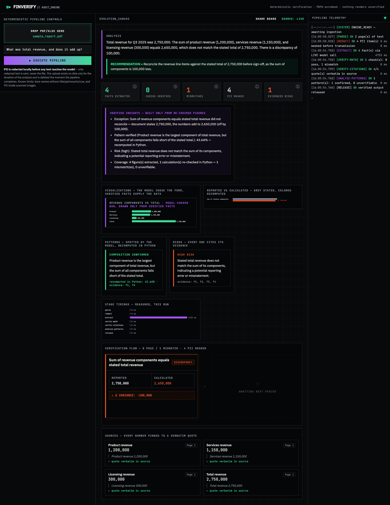
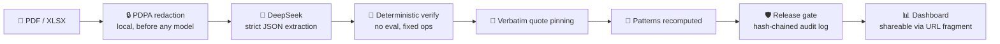

# FinVerify 🔍

**AI-powered financial report analysis that refuses to believe itself.**
DevLeague Lab 1 (Experian). Every number the model extracts is recomputed
deterministically in Python, pinned to a verbatim source quote, and nothing
renders until it has passed a visible CI pipeline. 🧮 ≠ 🤖

> LLMs are text engines. Ours is not allowed near a calculator —
> it proposes, Python disposes. 😤

## The dashboard


*A live run: KPI tiles (hover the ⓘ), the model-chosen chart drawn only
from verified facts, reported-vs-calculated comparison, evidenced risks,
measured stage timings, the caught RM 100k discrepancy, and every source
quote-pinned.*

## Pipeline



## Run

```bash
uv sync
cp .env.example .env            # DEEPSEEK_API_KEY
uv run python make_sample.py    # sample with a planted RM 100k error
uv run python test_backend.py   # 217 tests, offline, zero API cost ✅
uv run python server.py         # http://127.0.0.1:7861
```

## Why trust it 🧾

| Claim | Enforcement |
|---|---|
| Model never does the math | `grep -F "eval(" backend.py` → nothing; 3 fixed ops only |
| No self-graded checks | expected values resolve from **cited** facts (`against_fact_id`) |
| Quotes are real | every operand string-matched into the source |
| PII never reaches the model | NRIC (date-validated), emails, phones, names, PDF author — masked first, counts measured |
| Telemetry can't be doctored | every event hash-chained + HMAC-signed; root in the release |
| Charts can't lie | model picks the form, only verified facts supply data; unknown kinds degrade to the table |
| Boards share like Power BI | whole dashboard rides the URL **fragment** — no server, no storage 📤 |

## Contributing & developer tips

See [CONTRIBUTING.md](CONTRIBUTING.md) and [docs/PITCH.md](docs/PITCH.md) /
[docs/RUNBOOK.md](docs/RUNBOOK.md). Test-first or it didn't happen. 🚦
